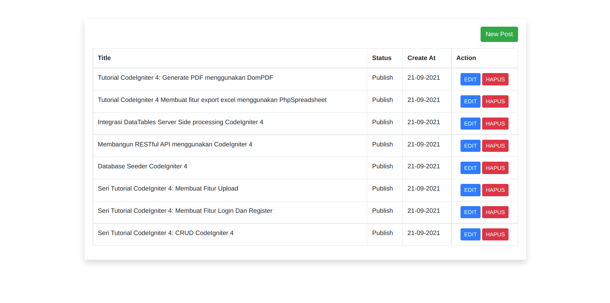

## Belajar Laravel 8: CRUD
Ini adalah repositori untuk dokumentasi [belajar laravel 8: crud](https://qadrlabs.com/post/belajar-laravel-8-membuat-aplikasi-crud-sederhana)

## How to use
- Clone repositori ini menggunakan `git clone`
- Copy `.env.example` menjadi `.env` dan edit credentials database di file ini.
- Run command `composer install`
- Run command `php artisan key:generate`
- Run command `php artisan migrate`
- Run command `php artisan serve`, lalu buka halamannya di browser.
